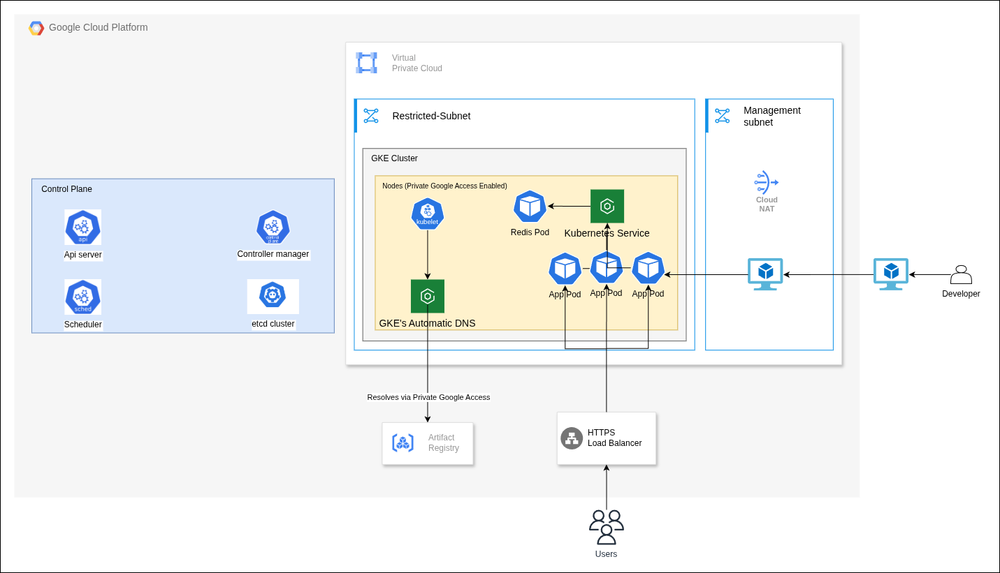

# GKE Terraform Deployment

This project provisions a secure Google Kubernetes Engine (GKE) cluster using Terraform and deploys workloads using Kubernetes manifests.
## Architecture




## Structure

```
Terraform/
  main.tf, variables.tf, ...
  modules/
    gke/         # GKE cluster and node pool
    network/     # VPC, subnets
    security/    # Firewall rules
    compute/     # VM resources
    artifact/    # Artifact Registry
Manifests/
  deployments.yml
  services.yml
  statefulsets.yml
```

## Features

- **Private GKE Cluster** with authorized networks and private endpoint
- **Custom Node Pool** with preemptible nodes and custom service account
- **Firewall Rules** for egress control and Google APIs
- **Artifact Registry** for container images
- **Kubernetes Manifests** for app/service deployment

## Prerequisites

- [Terraform](https://www.terraform.io/downloads)
- [gcloud CLI](https://cloud.google.com/sdk/docs/install)
- [kubectl](https://kubernetes.io/docs/tasks/tools/)
- Google Cloud project with billing enabled

## Usage

### 1. Configure Variables

Edit `Terraform/terraform.tfvars` or set variables as needed.

### 2. Initialize and Apply Terraform

```sh
cd Terraform
terraform init
terraform apply
```

This will create the VPC, subnets, firewall rules, Artifact Registry, GKE cluster, and node pool.

### 3. Get GKE Credentials

```sh
gcloud container clusters get-credentials <cluster_name> --region <region> --project <project_id>
```

### 4. Deploy Kubernetes Resources

```sh
kubectl apply -f ../Manifests/deployments.yml
kubectl apply -f ../Manifests/services.yml
kubectl apply -f ../Manifests/statefulsets.yml
```

## Notes

- **Images:** Use Artifact Registry URLs (e.g., `us-docker.pkg.dev/PROJECT/REPO/IMAGE:TAG`).
- **Service Account:** Node pool uses a custom service account with minimal permissions.

## Troubleshooting

- If pods show `ImagePullBackOff`, ensure firewall rules allow egress to Artifact Registry IPs.
- IAM permission changes may take a few minutes to propagate.

